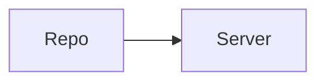
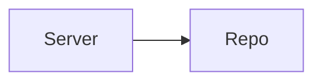

Texts
=====

This repository contains all of the texts that we use and display in the
reading environment on Ambuda.

Currently, this repo is a source of truth: when deploying or initializing the
main application ([ambuda/ambuda][main]), we populate the library with texts
from this repo. In other words, the data flow is:

In the future, however, our server will support receiving user corrections. At
that time, we will instead use the server as a source of truth and save regular
snapshots to this repo:

[main]: https://github.com/ambuda-org/ambuda

Data format
-----------

We store our texts as TEI XML files. (TEI is a set of XML conventions that is
commonly used in digital humanities. [See the Ambuda docs][tei] for a quick
introduction to TEI XML.)

[tei]: https://ambuda.readthedocs.io/en/latest/tei-xml.html

Licenses
--------

Our texts come from various sources, each of which have their own licenses.
Generally, these texts are under permissive licenses. Where they are not, we
have made good-faith efforts to contact the parties responsible and secure
rights to use those texts on Ambuda.

For details on a text's license, check the `<teiHeader>` element in the text.

If you wish to assert copyright over any of the texts in this repository,
please [contact us][contact] or create a GitHub issue, and we will immediately
remove the text after investigating the claim.

[contact]: https://ambuda.org/about/contact
